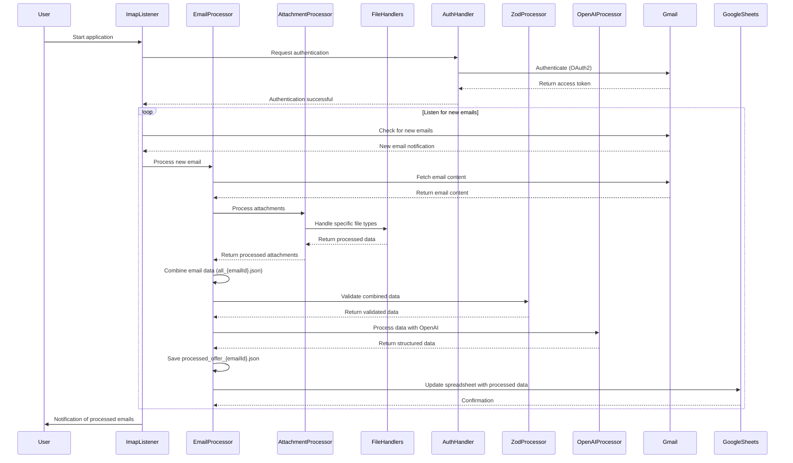

# Gmail Extractor

## Overview
Gmail Extractor is an automated system for processing email attachments from a Gmail account. It downloads attachments, processes them based on their file type, and saves the processed data in a structured format. The system is designed to handle various file types including PDFs, Word documents, Excel spreadsheets, CSVs, and images.

## Table of Contents
1. [Project Structure](#project-structure)
2. [Prerequisites](#prerequisites)
3. [Installation](#installation)
4. [Configuration](#configuration)
   - [Environment Variables](#environment-variables)
   - [Google Cloud Console Setup](#google-cloud-console-setup)
   - [Credentials File](#credentials-file)
   - [Gmail Account Settings](#gmail-account-settings)
5. [Usage](#usage)
6. [File Processing](#file-processing)
7. [Troubleshooting](#troubleshooting)
8. [Deployment](#deployment)
9. [Contributing](#contributing)
10. [License](#license)

## Project Structure
```
gmail-extractor/
│
├── config/
│   └── constants.js
│
├── logs/
│
├── src/
│   ├── attachments/
│   │   ├── fileHandler/
│   │   │   ├── imageHandler.js
│   │   │   ├── pdfHandler.js
│   │   │   ├── spreadsheetHandler.js
│   │   │   └── wordHandler.js
│   │   └── attachmentProcessor.js
│   │
│   ├── auth/
│   │   └── authHandler.js
│   │
│   ├── email/
│   │   ├── emailProcessor.js
│   │   ├── imapListener.js
│   │   └── resetEmailsAndAttachments.js
│   │
│   ├── google-sheets/
│   │   └── google-sheets-api.js
│   │
│   ├── utils/
│   │   ├── combineEmailData.js
│   │   ├── convertPdfToImage.js
│   │   ├── createDataDirectories.js
│   │   ├── deleteFile.js
│   │   ├── fileUtils.js
│   │   └── logger.js
│   │
│   └── zod-json/
│       ├── emailDataProcessor.js
│       └── emailDataSchema.js
│
├── .env
├── .gitignore
├── credentials.json
├── Dockerfile
├── index.js
├── package.json
├── README.md
└── token.json
```

## Prerequisites
- Node.js (v14 or later)
- npm or Yarn
- A Gmail account
- Google Cloud Console project with Gmail API enabled

## Installation
1. Clone the repository:
   ```
   git clone https://github.com/yourusername/gmail-extractor.git
   cd gmail-extractor
   ```

2. Install dependencies:
   ```
   npm install
   ```
   or if you're using Yarn:
   ```
   yarn install
   ```

3. Copy the `.env.example` file to `.env`:
   ```
   cp .env.example .env
   ```

## Configuration

### Environment Variables
Edit the `.env` file and fill in your specific details:
- `EMAIL_ADDRESS`: Your Gmail address
- `PROCESSED_DIR`: Directory for processed attachments (e.g., `processed_attachments`)
- Add any other necessary environment variables

### Google Cloud Console Setup
1. Go to the [Google Cloud Console](https://console.cloud.google.com/).
2. Create a new project or select an existing one.
3. Enable the Gmail API for your project.
4. Go to "Credentials" and create an OAuth 2.0 Client ID.
5. Set up the OAuth consent screen if prompted.
6. For "Application type", choose "Web application".
7. Add `http://localhost:3000/auth/google/callback` to the "Authorized redirect URIs".

### Credentials File
Create a `credentials.json` file in the root directory with the following structure:
```json
{
  "web": {
    "client_id": "YOUR_CLIENT_ID.apps.googleusercontent.com",
    "project_id": "your-project-name",
    "auth_uri": "https://accounts.google.com/o/oauth2/auth",
    "token_uri": "https://oauth2.googleapis.com/token",
    "auth_provider_x509_cert_url": "https://www.googleapis.com/oauth2/v1/certs",
    "client_secret": "YOUR_CLIENT_SECRET",
    "redirect_uris": ["http://localhost:3000/auth/google/callback"]
  }
}
```

### Gmail Account Settings
1. Enable IMAP in your Gmail settings.
2. If not using OAuth, create an App Password:
   - Go to your Google Account settings.
   - Select "Security".
   - Under "Signing in to Google," select "App Passwords".
   - Generate a new App Password for "Mail" and "Other (Custom name)".
   - Use this password in your `.env` file instead of your regular Gmail password.

## Usage
To start the Gmail extractor:
```
npm start
```
On first run, you'll be prompted to authorize the application. Follow the URL provided in the console to complete the OAuth2 flow.

## Process Flow

Below is a sequence diagram illustrating the main process flow of the Gmail Extractor:



## File Processing
The system processes the following file types:
- PDF: Handled by `pdfHandler.js`
- Word (.doc, .docx): Handled by `wordHandler.js`
- Excel (.xls, .xlsx), CSV: Handled by `spreadsheetHandler.js`
- Images (.png, .jpg, .jpeg): Handled by `imageHandler.js`

Processed files and their extracted data are managed by `attachmentProcessor.js`.

## Troubleshooting
- If you encounter authentication issues, ensure your `credentials.json` file is correctly set up and your Gmail account settings are properly configured.
- Check the logs in the `logs/` directory for detailed error messages.
- For IMAP connection issues, verify that IMAP is enabled in your Gmail settings and that your network allows the connection.

## Deployment
For deploying to a production environment:
1. Ensure all sensitive data (like `credentials.json` and `.env`) are properly secured and not exposed in your repository.
2. Consider using environment variables for all sensitive information.
3. If deploying to a cloud service, follow their specific guidelines for Node.js applications.
4. Use a process manager like PM2 to keep the application running continuously.

## Contributing
Contributions are welcome! Please feel free to submit a Pull Request.

## License
[Specify your license here, e.g., MIT, GPL, etc.]